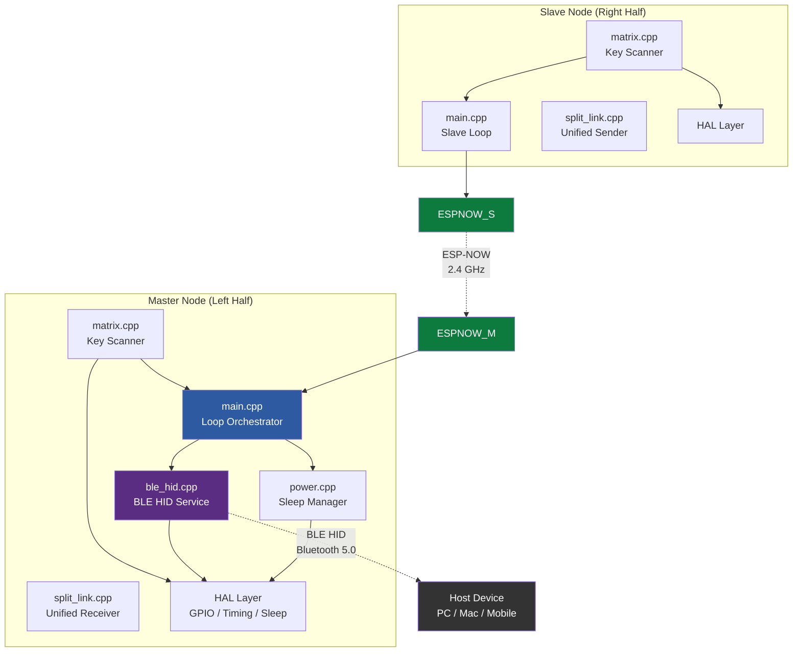
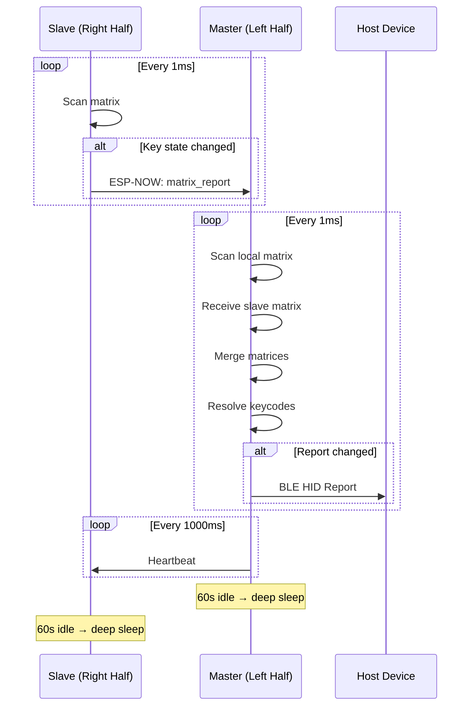
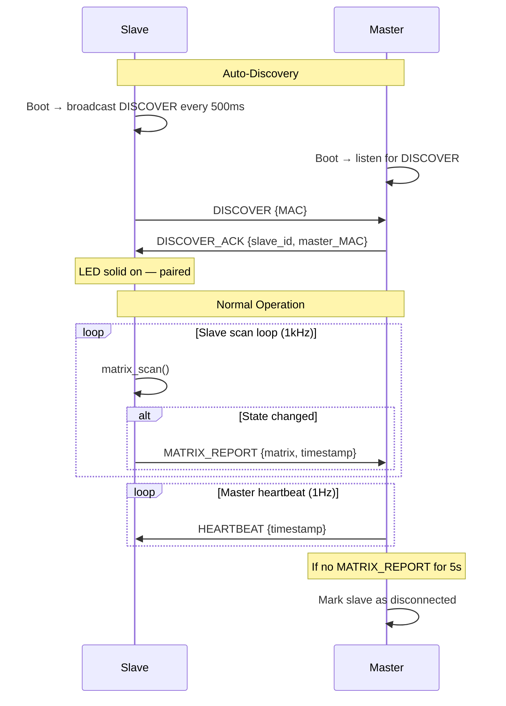
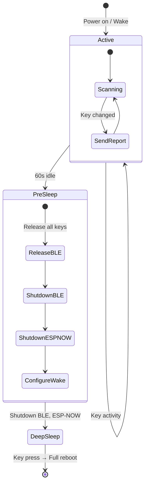

# C3-Cascade — Wireless Split Keyboard Firmware Guide

> Custom wireless split keyboard firmware with BLE HID, ESP-NOW inter-half communication, deep sleep power management, and multi-MCU portability.

---

## Table of Contents

1. [Project Overview](#project-overview)
2. [Architecture](#architecture)
3. [Hardware Setup](#hardware-setup)
4. [Key Matrix Wiring](#key-matrix-wiring)
5. [Supported MCUs](#supported-mcus)
6. [Building & Flashing](#building--flashing)
7. [Configuration](#configuration)
8. [BLE HID Keyboard](#ble-hid-keyboard)
9. [ESP-NOW Split Protocol](#esp-now-split-protocol)
10. [Deep Sleep & Wake](#deep-sleep--wake)
11. [Adding a Slave Half](#adding-a-slave-half)
12. [Adding a New MCU](#adding-a-new-mcu)
13. [Keymap Customization](#keymap-customization)
14. [Troubleshooting](#troubleshooting)

---

## Project Overview

**C3-Cascade** is a from-scratch wireless split keyboard firmware designed for the Seeed Studio XIAO ESP32-C3, with portability to ESP32-C6 and nRF52840.

### Key Features

| Feature | Description |
|---------|-------------|
| **Wireless BLE HID** | Connects to PC/Mac/mobile as a standard Bluetooth keyboard |
| **Unified Split Link** | ESP-NOW and WiFi UDP communication with auto-discovery |
| **Dual Mode Master** | Master can accept ESP-NOW and WiFi UDP slaves simultaneously |
| **ESP-NOW** | Ultra-low-latency inter-half communication (~1ms) for ESP32 |
| **WiFi UDP** | Cross-platform communication support (Pico W / cross-board) |
| **Deep sleep** | Auto-sleeps after 60s idle; wakes on any keypress |
| **Multi-MCU** | Supports ESP32-C3, ESP32-C6, nRF52840 via HAL abstraction |
| **6KRO** | Standard 6-key rollover + modifier keys |

### Project Structure

```
c3-cascade/
├── layout - primary.txt          # Physical key layout definition
├── docs/
│   └── firmware_guide.md         # This document
├── firmware/
│   ├── platformio.ini            # Build configuration (multi-environment)
│   ├── include/
│   │   ├── config.h              # Central configuration & feature flags
│   │   ├── pins.h                # Per-MCU GPIO pin definitions
│   │   ├── keymap.h              # HID keycode matrix & layers
│   │   └── hal/
│   │       ├── hal.h             # Hardware abstraction interface
│   │       ├── hal_esp32.h       # ESP32-specific extensions
│   │       └── hal_nrf52.h       # nRF52840-specific extensions
│   ├── src/
│   │   ├── main.cpp              # Entry point (setup/loop)
│   │   ├── matrix.cpp/.h         # Key matrix scanner with debounce
│   │   ├── ble_hid.cpp/.h        # BLE HID keyboard service
│   │   ├── split_link.cpp/.h     # Unified split link (ESP-NOW + WiFi UDP)
│   │   ├── power.cpp/.h          # Deep sleep & idle management
│   │   └── hal/
│   │       ├── hal_esp32.cpp     # ESP32-C3/C6 HAL implementation
│   │       └── hal_nrf52.cpp     # nRF52840 HAL (skeleton)
│   └── lib/                      # Local libraries (future)
```

---

## Architecture



### Data Flow



---

## Hardware Setup

### Required Components (Per Half)

| Component | Quantity | Notes |
|-----------|----------|-------|
| Seeed XIAO ESP32-C3 | 1 | Or ESP32-C6 / nRF52840 |
| Key switches | 30 max | Cherry MX compatible |
| 1N4148 diodes | 30 | One per key (anti-ghosting) |
| LiPo battery | 1 | 3.7V, 500–1000mAh |
| IPEX antenna | 1 | Included with XIAO |

### Wiring Diagram (Matrix)

```
  Diodes prevent ghosting — cathode (band) towards the column wire.

       COL0    COL1    COL2    COL3    COL4    COL5
       (D0)    (D2)    (D5)    (D3)    (D4)    (D1)
        │       │       │       │       │       │
ROW0 ───┤───────┤───────┤───────┤───────┤───────┤── (D10)
(D10)   ├─►D──┐ ├─►D──┐ ├─►D──┐ ├─►D──┐ ├─►D──┐ ├─►D──┐
        │  SW  │ │  SW  │ │  SW  │ │  SW  │ │  SW  │ │  SW  │
        │ ESC  │ │  1   │ │  2   │ │  3   │ │  4   │ │  5   │
        ▼      │ ▼      │ ▼      │ ▼      │ ▼      │ ▼      │
               │        │        │        │        │        │
ROW1 ──────────┤────────┤────────┤────────┤────────┤────────┤── (D9)
        ...    ...     ...      ...     ...      ...

  SW = Switch,  D = 1N4148 diode,  ►D = diode direction (anode→cathode)

  ROW pins: OUTPUT (driven LOW one at a time during scan)
  COL pins: INPUT_PULLUP (read LOW when key pressed)
```

### Battery Connection

```
  Battery (3.7V LiPo)
  ┌─────────────────┐
  │  (+) ─── BAT+   │  ← XIAO battery pads (on bottom)
  │  (−) ─── BAT−   │
  └─────────────────┘
```

> **Note:** The XIAO ESP32-C3 has built-in LiPo charging via USB-C. Connect the battery to the BAT+/BAT− pads on the underside of the board.

---

## Key Matrix Wiring

### Primary Layout (Left Half) — from `layout - primary.txt`

```
         COL0(D0)  COL1(D2)  COL2(D5)  COL3(D3)  COL4(D4)  COL5(D1)
ROW0(D10)  ESC       1         2         3         4         5
ROW1(D9)   TAB       Q         W         E         R         T
ROW2(D8)   CAPS      A         S         D         F         G
ROW3(D7)   LSHIFT    Z         X         C         V         B
ROW4(D6)   LCTRL     LGUI      LALT      ---       SPACE     ---
```

### Pin Mapping

| Matrix | Board Pin | ESP32-C3 GPIO | ESP32-C6 GPIO | Direction |
|--------|-----------|---------------|---------------|-----------|
| ROW0 | D10 | GPIO10 | GPIO18 | Output |
| ROW1 | D9  | GPIO9  | GPIO20 | Output |
| ROW2 | D8  | GPIO8  | GPIO19 | Output |
| ROW3 | D7  | GPIO7  | GPIO17 | Output |
| ROW4 | D6  | GPIO6  | GPIO16 | Output |
| COL0 | D0  | GPIO0  | GPIO0  | Input (pull-up) |
| COL1 | D2  | GPIO2  | GPIO2  | Input (pull-up) |
| COL2 | D5  | GPIO5  | GPIO23 | Input (pull-up) |
| COL3 | D3  | GPIO3  | GPIO21 | Input (pull-up) |
| COL4 | D4  | GPIO4  | GPIO22 | Input (pull-up) |
| COL5 | D1  | GPIO1  | GPIO1  | Input (pull-up) |

---

## Supported MCUs

### Seeed Studio XIAO ESP32-C3 ✅ (Primary Target)

- **SoC:** ESP32-C3 (RISC-V, 160 MHz)
- **Wireless:** Wi-Fi 4 + Bluetooth 5.0 LE
- **GPIO:** 11 digital I/O
- **RTC GPIO (deep sleep wake):** GPIO 0–5
- **Flash:** 4 MB
- **Size:** 21 × 17.5 mm

### Seeed Studio XIAO ESP32-C6 ✅ (Supported)

- **SoC:** ESP32-C6 (RISC-V, 160 MHz)
- **Wireless:** Wi-Fi 6 + Bluetooth 5.3 LE + 802.15.4 (Thread/Zigbee)
- **GPIO:** 15 total (11 digital, 4 analog)
- **LP GPIO (deep sleep wake):** GPIO 0–7
- **Size:** 21 × 17.5 mm

### nRF52840 🟡 (Skeleton — Future)

- **SoC:** nRF52840 (ARM Cortex-M4F, 64 MHz)
- **Wireless:** Bluetooth 5.0 LE
- **GPIO:** 48 (P0.xx, P1.xx)
- **Deep sleep:** System OFF with GPIO SENSE
- **Note:** ESP-NOW not available — needs BLE-based split protocol

---

## Building & Flashing

### Prerequisites

1. Install [PlatformIO IDE](https://platformio.org/install/ide?install=vscode) (VS Code extension) or PlatformIO Core (CLI)
2. Connect your XIAO board via USB-C

### Build Commands

```bash
# Navigate to firmware directory
cd firmware/

# Build for ESP32-C3 (master — default)
pio run -e xiao_esp32c3

# Build for ESP32-C3 (slave — right half)
pio run -e xiao_esp32c3_slave

# Build for ESP32-C6 (master)
pio run -e xiao_esp32c6

# Build for nRF52840 (skeleton)
pio run -e nrf52840
```

### Flash Commands

```bash
# Flash to ESP32-C3 (master)
pio run -e xiao_esp32c3 -t upload

# Flash to ESP32-C3 (slave)
pio run -e xiao_esp32c3_slave -t upload

# Monitor serial output
pio device monitor -b 115200
```

### Entering Bootloader Mode (XIAO ESP32-C3)

If the board doesn't auto-detect:
1. Hold the **BOOT** button
2. Press and release **RESET**
3. Release **BOOT**
4. The board appears as a USB serial device

---

## Configuration

All configuration is centralized in `include/config.h`:

### Board Selection

Set automatically by PlatformIO build flags — no manual editing needed:
- `-DBOARD_XIAO_ESP32C3`
- `-DBOARD_XIAO_ESP32C6`
- `-DBOARD_NRF52840`

### Split Role

Set by build flags in `platformio.ini`:
- `-DSPLIT_ROLE_MASTER` — Left half (BLE HID + ESP-NOW receiver)
- `-DSPLIT_ROLE_SLAVE` — Right half (ESP-NOW sender only)

### Feature Flags

```cpp
#define ENABLE_BLE_HID          1   // BLE keyboard output
#define ENABLE_SPLIT_LINK       1   // ESP-NOW communication
#define ENABLE_DEEPSLEEP        1   // Auto deep sleep
#define ENABLE_BATTERY_REPORT   0   // BLE battery level (future)
#define ENABLE_RGB              0   // RGB LEDs (future)
#define ENABLE_LED              1   // Onboard LED for status indication
```

### Timing

```cpp
#define MATRIX_SCAN_INTERVAL_US 1000    // 1ms scan rate (1kHz)
#define DEBOUNCE_MS             5       // Key debounce time
#define DEEPSLEEP_TIMEOUT_MS    60000   // 60s idle → sleep
#define HID_REPORT_INTERVAL_MS  8       // ~125Hz report rate
#define PAIRING_SHORTCUT_HOLD_MS    5000    // Hold time for pairing shortcuts
#define PAIRING_MODE_TIMEOUT_MS    60000   // Auto-exit pairing mode after 60s
#define LED_BLINK_INTERVAL_MS      300     // LED toggle interval during pairing
```

### Split Link Auto-Discovery

The split link uses automatic discovery — no hardcoded MAC addresses needed:

- **Master** boots and listens for slave discovery broadcasts
- **Slave** boots and broadcasts DISCOVER packets every 500ms
- When the master receives a DISCOVER, it registers the slave and replies with DISCOVER_ACK
- The slave never gives up — if no master is found, it keeps scanning (ESP-NOW: broadcasts every 500ms; WiFi UDP: scans for the AP every 5 seconds)

See [Pairing Guide](pairing-guide.md) for keyboard shortcut triggers and detailed pairing procedures.

---

## BLE HID Keyboard

### How It Works

The master node acts as a BLE HID keyboard:

1. On boot, it starts advertising as **"C3-Cascade"**
2. Host device (PC/Mac/phone) discovers and pairs with it
3. Pairing uses "Just Works" (no PIN) with bonding
4. After pairing, the master sends standard HID keyboard reports
5. On disconnect, advertising resumes automatically

### Report Format (6KRO Boot Keyboard)

```
Byte 0:    Modifier keys (bitmask)
             Bit 0: Left Ctrl
             Bit 1: Left Shift
             Bit 2: Left Alt
             Bit 3: Left GUI (Win/Cmd)
             Bit 4: Right Ctrl
             Bit 5: Right Shift
             Bit 6: Right Alt
             Bit 7: Right GUI
Byte 1:    Reserved (0x00)
Bytes 2-7: Key codes (up to 6 simultaneous keys)
```

### Pairing on Different Operating Systems

| OS | Steps |
|----|-------|
| **Windows** | Settings → Bluetooth → Add device → "C3-Cascade" |
| **macOS** | System Preferences → Bluetooth → "C3-Cascade" → Connect |
| **Linux** | `bluetoothctl` → `scan on` → `pair <MAC>` → `connect <MAC>` |
| **iOS** | Settings → Bluetooth → "C3-Cascade" |
| **Android** | Settings → Bluetooth → Pair "C3-Cascade" |

### Reconnection After Wake

When the keyboard wakes from deep sleep:
1. BLE stack reinitializes
2. Advertising resumes
3. If the host has bonded, it reconnects automatically (~1-3 seconds)
4. No re-pairing needed

### Pairing Mode

When entering BLE PC pairing mode (ESC + SPACE for 5 seconds), the keyboard enters a special state:

- **All keys are suppressed except ESC, SHIFT, and SPACE** — the keys needed for pairing shortcuts
- The onboard LED blinks (Pico W only) to indicate pairing mode is active
- Pairing mode exits automatically when:
  - A BLE host connects, **or**
  - 60 seconds elapse (timeout)
- Deep sleep is inhibited during pairing mode

When entering slave search mode (ESC + SHIFT for 5 seconds), the same key suppression and LED behavior applies. The mode exits when a slave connects or after 60 seconds.

See [Pairing Guide](pairing-guide.md) for full details.

---

## Split Link Protocol

### Overview

The split link provides wireless communication between keyboard halves using either ESP-NOW or WiFi UDP, depending on the board:

| Board | Role | Transport Support |
|-------|------|-------------------|
| ESP32-C3/C6 | Master | **Dual Mode** (ESP-NOW + WiFi UDP) |
| ESP32-C3/C6 | Slave | ESP-NOW |
| Pico 2W | Master | WiFi UDP |
| Pico 2W | Slave | WiFi UDP |
| nRF52840 | — | None (stub) |

**ESP-NOW** (ESP32 only):
- **Latency:** ~1ms
- **Max packet size:** 250 bytes
- **Range:** ~30m (line of sight)
- **No Wi-Fi AP needed** — direct peer-to-peer

**WiFi UDP** (Pico W, or any master):
- Master creates a SoftAP with SSID "C3C-XXXX" (last 4 hex of MAC)
- Slave scans for the AP and connects
- Discovery via UDP broadcast on port 4200
- Works across platforms (ESP32 ↔ Pico W)

### Auto-Discovery Flow

Both transports use the same DISCOVER/DISCOVER_ACK handshake — no hardcoded MAC addresses needed:

1. **Master** boots → starts listening for DISCOVER packets
2. **Slave** boots → broadcasts DISCOVER packets every 500ms
3. **Master** receives DISCOVER → registers slave → replies with DISCOVER_ACK (includes assigned ID)
4. **Slave** receives ACK → paired, begins sending MATRIX_REPORT via unicast

The slave **never gives up** — if no master is found, it keeps scanning indefinitely. Power the halves on in any order.

### Packet Format

```cpp
struct split_packet_t {            // Total: ~11 bytes
    uint8_t  type;                 // Packet type
    uint8_t  slave_id;             // Slave identifier
    uint8_t  matrix[MATRIX_ROWS];  // Key matrix state (5 bytes)
    uint32_t timestamp;            // Sender's millis()
    uint8_t  battery_level;        // Battery % or 0xFF
};
```

### Packet Types

| Type | Direction | Purpose |
|------|-----------|---------|
| `MATRIX_REPORT` (0x01) | Slave → Master | Key matrix state update |
| `HEARTBEAT` (0x02) | Master → Slave | Alive signal (1Hz) |
| `SYNC` (0x03) | Master → Slave | Layer change, config sync |
| `ACK` (0x04) | Both | Acknowledgment |

### Communication Flow



### Multi-Slave Support

The firmware supports up to 2 slave nodes (configurable via `MAX_SLAVE_NODES`). Each slave has a unique `slave_id` and MAC address. The master tracks each slave independently.

---

## Deep Sleep & Wake

### How It Works



### Wake Mechanism (ESP32-C3)

- Only **GPIO 0–5** are RTC-capable (can wake from deep sleep)
- All **column pins** (COL0–COL5 = GPIO0–GPIO5) are RTC-capable ✅
- Before sleep, all **row pins** are driven **LOW**
- Column pins are set to **INPUT_PULLUP**
- When a key is pressed, it connects a LOW row to a column, pulling the column LOW
- This triggers `ESP_GPIO_WAKEUP_GPIO_LOW` → the MCU wakes

### Power Consumption Estimates

| State | Current | Battery Life (500mAh) |
|-------|---------|----------------------|
| Active (BLE connected) | ~30 mA | ~16 hours |
| Active (BLE advertising) | ~80 mA | ~6 hours |
| Deep sleep | ~5 µA | ~11 years |

> **Note:** Actual values depend on BLE connection interval, scan rate, and antenna efficiency.

### Customizing Sleep Timeout

Edit `config.h`:

```cpp
#define DEEPSLEEP_TIMEOUT_MS    60000   // 60 seconds (default)
#define DEEPSLEEP_TIMEOUT_MS    120000  // 2 minutes
#define DEEPSLEEP_TIMEOUT_MS    300000  // 5 minutes
```

### Sleep Inhibition

Deep sleep is **inhibited** during:
- **Master:** BLE PC pairing mode or slave search mode (ESC+SPACE or ESC+SHIFT held for 5s)
- **Slave:** While searching for a master (`!split_link_is_paired()`)

This prevents the keyboard from going to sleep while waiting for a connection.

---

## Adding a Slave Half

### Step-by-Step

1. **Create the physical layout file:**
   ```
   # layout - secondary.txt
   ESP32C3 XIAO (Right Half)
   D10 - ROW 0
   6, 7, 8, 9, 0, Backspace
   ...
   ```

2. **Add the secondary keymap** in `keymap.h`:
   ```cpp
   static const uint16_t KEYMAP_SECONDARY_L0[MATRIX_ROWS][MATRIX_COLS] = {
       { HID_KEY_6, HID_KEY_7, HID_KEY_8, ... },
       ...
   };
   ```

3. **Flash both halves** with the appropriate environments:
   - Master: `pio run -e xiao_esp32c3 -t upload`
   - Slave: `pio run -e xiao_esp32c3_slave -t upload`

4. **Power on both halves** — they will auto-discover each other. No MAC address configuration needed.

See [Pairing Guide](pairing-guide.md) for manual re-pairing procedures.

---

## Adding a New MCU

### Step-by-Step

1. **Add a new board define** in `config.h`:
   ```cpp
   #elif defined(BOARD_MY_NEW_MCU)
       #define BOARD_NAME      "My New MCU"
       #define HAS_ESPNOW      0  // or 1 if ESP-based
       #define HAS_NIMBLE       0
       ...
   ```

2. **Add pin definitions** in `pins.h`:
   ```cpp
   #elif defined(BOARD_MY_NEW_MCU)
   static const uint8_t ROW_PINS[MATRIX_ROWS] = { ... };
   static const uint8_t COL_PINS[MATRIX_COLS] = { ... };
   ```

3. **Create HAL implementation** in `src/hal/hal_my_mcu.cpp`:
   - Implement all functions in the `hal::` namespace
   - See `hal_esp32.cpp` as a reference

4. **Add HAL header** in `include/hal/hal_my_mcu.h`

5. **Add PlatformIO environment** in `platformio.ini`:
   ```ini
   [env:my_new_mcu]
   platform = ...
   board = ...
   build_flags = -DBOARD_MY_NEW_MCU -DSPLIT_ROLE_MASTER
   ```

6. **Build and test:**
   ```bash
   pio run -e my_new_mcu
   ```

---

## Keymap Customization

### Adding New Keys

All HID key codes are defined in `keymap.h`. To add a new key:

1. Find the USB HID Usage ID from the [USB HID Usage Tables](https://usb.org/sites/default/files/hut1_4.pdf) (Page 0x07)
2. Add a `#define` in `keymap.h`:
   ```cpp
   #define HID_KEY_F1    0x3A
   #define HID_KEY_F12   0x45
   ```
3. Place it in the appropriate matrix position

### Modifier Keys

Modifier keys use a special encoding:
```cpp
MOD_KEY(HID_MOD_LSHIFT)   // Left Shift
MOD_KEY(HID_MOD_LCTRL)    // Left Control
MOD_KEY(HID_MOD_LALT)     // Left Alt
MOD_KEY(HID_MOD_LGUI)     // Left GUI (Win/Cmd)
```

### Adding Layers

1. Define a new layer array in `keymap.h`:
   ```cpp
   static const uint16_t KEYMAP_LAYER_2[MATRIX_ROWS][MATRIX_COLS] = { ... };
   ```
2. Update `NUM_LAYERS` and `KEYMAP_LAYERS` table
3. Add layer-switching logic in `main.cpp` (e.g., hold FN key to activate layer 1)

---

## Troubleshooting

### Build Errors

| Error | Solution |
|-------|----------|
| `No board type defined` | Check `platformio.ini` build_flags |
| `NimBLE not found` | Run `pio lib install "h2zero/NimBLE-Arduino"` |
| `esp_now.h not found` | Ensure ESP32 platform is installed |

### BLE Issues

| Problem | Solution |
|---------|----------|
| Device not appearing | Check antenna connection; reset BLE on host |
| Won't pair | Remove old pairing on host; reflash firmware |
| High latency | Reduce `HID_REPORT_INTERVAL_MS` |
| Disconnects frequently | Check battery; reduce connection interval |

### ESP-NOW Issues

| Problem | Solution |
|---------|----------|
| Slave not detected | Power on both halves; slave auto-discovers master |
| Packets dropping | Ensure same Wi-Fi channel; check antenna |
| High latency | Reduce scan interval; check for radio contention |

### LED Status (Pico W / Pico 2W)

| LED State | Meaning |
|-----------|---------|
| Blinking (master) | In BLE PC pairing mode or slave search mode |
| Blinking (slave) | Searching for master — not yet paired |
| Solid on (slave) | Connected to master — paired successfully |
| Off | Normal operation (master) or not applicable |

On XIAO ESP32 boards, no onboard LED is available (WS2812 RGB LED requires special library). Use serial debug output instead.

### Deep Sleep Issues

| Problem | Solution |
|---------|----------|
| Won't wake up | Check column pins are RTC-capable (GPIO 0-5 on C3) |
| Won't sleep | Check `ENABLE_DEEPSLEEP` is 1; verify idle timer |
| BLE doesn't reconnect | Wait 3-5 seconds; host may need to retry |
| Unexpected wake | Check for floating pins; add external pull-ups |

### Serial Debug

Enable debug output in `config.h`:
```cpp
#define DEBUG_SERIAL    1   // General debug
#define DEBUG_MATRIX    1   // Print matrix on every change
#define DEBUG_BLE       1   // BLE connection events
#define DEBUG_ESPNOW    1   // ESP-NOW packet logs
```

Monitor output:
```bash
pio device monitor -b 115200
```

---

## License

This firmware is provided as-is for personal use. Modify freely for your keyboard projects.

---

*C3-Cascade Firmware Guide — Last updated: May 2026*
